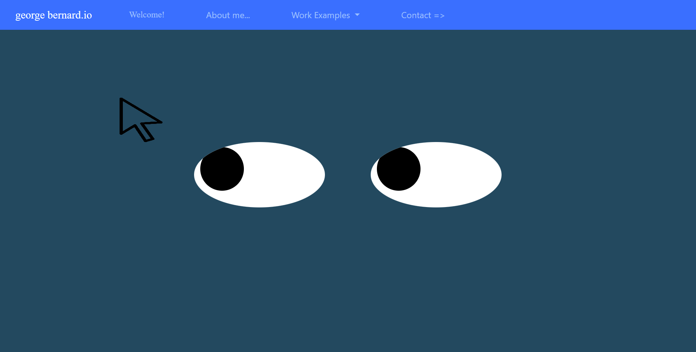

# Eyes
## The eyes are animated to folow the mouse by placing the pupils in white of eye in the same relative position as the mouse in the window.  

#files expected to render page index, eyes.css, nav.js, nav.html
##Uses JS, and CSS to animate eyes to follow mouse.

